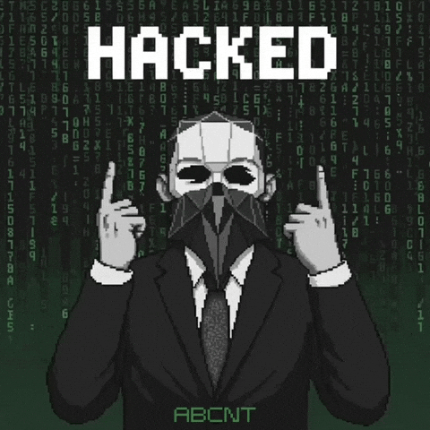

 

  

  

---

### ⚡ About Me

Cybersecurity researcher focused on backend systems, Android development, API infrastructure, and security research.

Building secure authentication systems, monitoring tools, automation services, and scalable backend applications.

---

### 🛠 Tech Stack

---

---

### 📈 Total Contributions

  
---

### 🚀 Focus Areas

🔐 Cybersecurity Research  
⚡ Backend Engineering  
📱 Android Development  
🌐 API & Network Systems  
🤖 Automation Tools  

---

### 🌐 Connect

---

> *"Security is not just finding vulnerabilities — it is protecting systems and people."*

